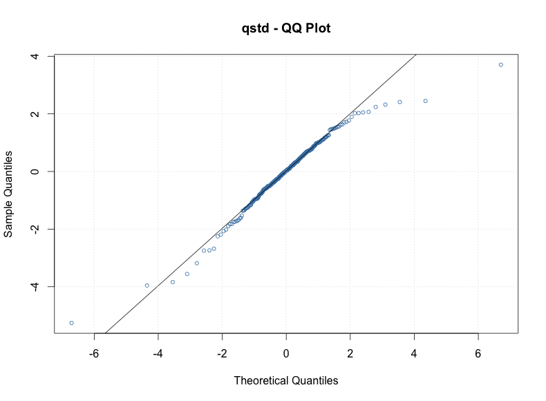
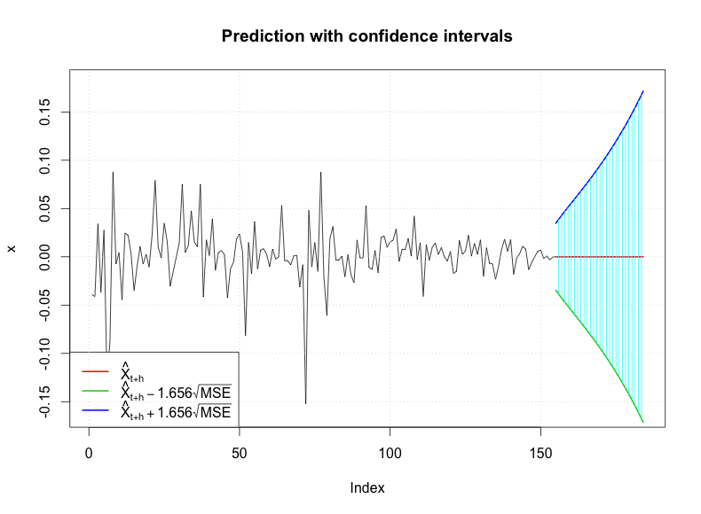

[](http://quantlet.de/index.php?p=info)

## [](http://quantlet.de/) **econ_tgarch** [](http://quantlet.de/d3/ia)

```yaml

Name of QuantLet : econ_tgarch

Published in : EconCrix

Description : 'Produces student t-GARCH estimation results using ARIMA model residuals.'

Keywords : 
- graphical representation
- plot 
- time-series
- data visualization
- garch
- forecast
- estimation

See also : 'econ_arima, econ_crix, econ_arch, econ_garch, econ_vola'

Author : Shi Chen

Submitted : Thur, July 28 2016 by Shi Chen

Datafile : 'crix.RData'

Example : 
- The ACF and PACF plots using tGARCH(1,1) model
- The QQ plot of tGARCH(1,1) residuals
- The 30 step ahead prediction using tGARCH(1,1) model


```






### R Code:
```r
rm(list = ls(all = TRUE))
graphics.off()

# install and load packages
libraries = c("FinTS", "tseries", "forecast", "fGarch")
lapply(libraries, function(x) if (!(x %in% installed.packages())) {
install.packages(x)
})
lapply(libraries, library, quietly = TRUE, character.only = TRUE)

# please change your working directory
setwd()

# load dataset
load(file = "crix.RData")
ret = diff(log(crix))
fit202 = arima(ret, order = c(2, 0, 2))
par(mfrow = c(1, 1))
res = fit202$residuals

fg11stu = garchFit(data = res, data ~ garch(1, 1), cond.dist = "std")

# different forecast with t-garch 
# fg11stufore = predict(fg11stu, n.ahead = 30, plot=TRUE, mse='uncond', auto.grid=FALSE)
fg11stufore = predict(fg11stu, n.ahead = 30, plot = TRUE, cond.dist = "QMLE", 
auto.grid = FALSE)

par(mfrow = c(1, 2))
stu.fg11res2 = fg11stu@residuals

# acf and pacf for t-garch
stu.acfres2 = acf(stu.fg11res2, ylab = NA, lag.max = 20, main = "ACF of Squared Residuals", 
lwd = 2)
stu.pacfres2 = pacf(stu.fg11res2, lag.max = 20, main = "PACF of Squared Residuals", 
lwd = 2, ylab = NA, ylim = c(-0.5, 0.5))

# ARIMA-t-GARCH qq plot
par(mfrow = c(1, 1))
plot(fg11stu, which = 13)

```
