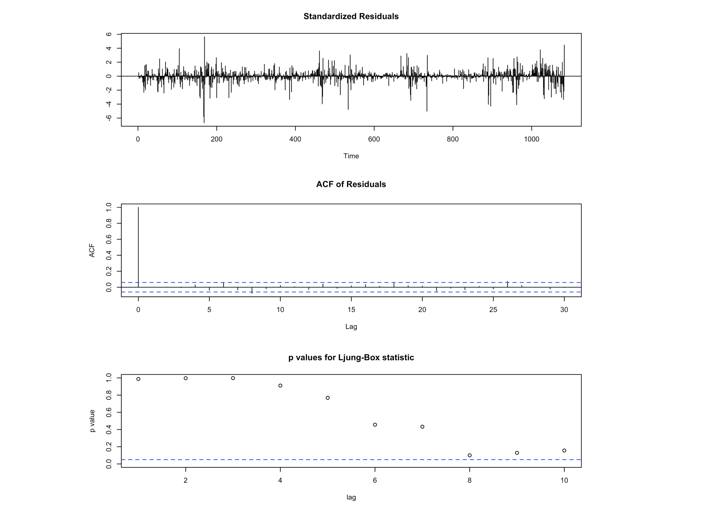
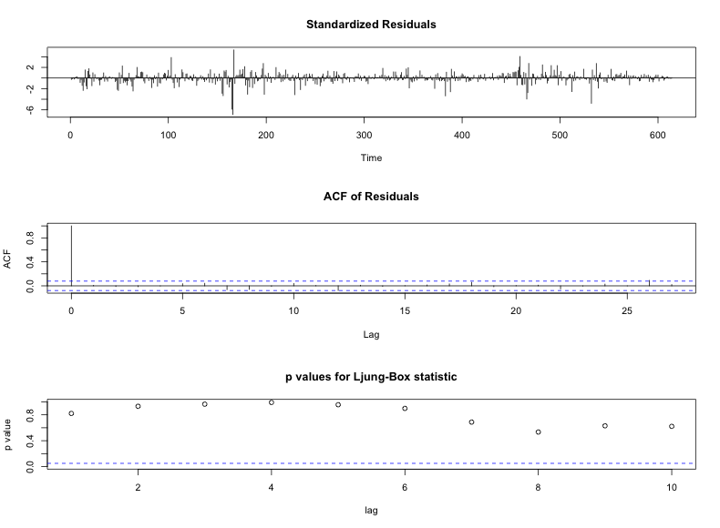
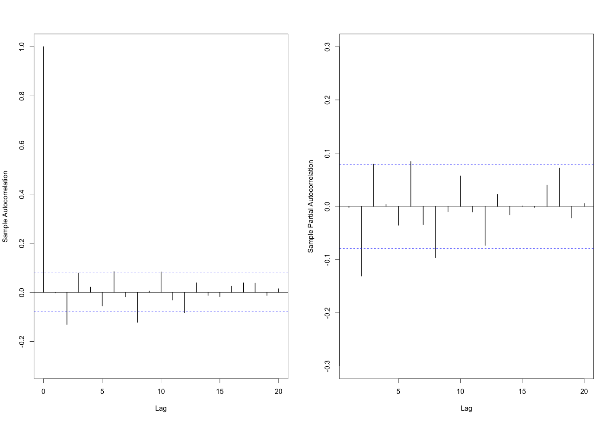

[](http://quantlet.de/index.php?p=info)

## [](http://quantlet.de/) **econ_arima** [](http://quantlet.de/d3/ia)

```yaml

Name of QuantLet : econ_arima

Published in : EconCrix

Description : 'Produces ARIMA estimation results using CRIX data.'

Keywords : 
- graphical representation
- plot 
- time-series
- data visualization
- arma
- estimation

See also : 'econ_arch, econ_crix, econ_garch, econ_vola'

Author : Shi Chen

Submitted : Thur, July 28 2016 by Shi Chen

Datafile : 'crix.RData'

Example : 
- The diagnostic checking of ARIMA(1,0,1) model.
- The diagnostic checking of ARIMA(2,0,2) model. 
- The forecast plot of ARIMA(2,0,2).
- The ACF and PACF plots of crix return.


```









### R Code:
```r
rm(list = ls(all = TRUE))
graphics.off()

# install and load packages
libraries = c("zoo", "tseries")
lapply(libraries, function(x) if (!(x %in% installed.packages())) {
  install.packages(x)
})
lapply(libraries, library, quietly = TRUE, character.only = TRUE)

# load dataset
load(file = "crix.RData")
ret = diff(log(crix))

# d order
Box.test(ret, type = "Ljung-Box", lag = 20)

# stationary test
adf.test(ret, alternative = "stationary")
kpss.test(ret, null = "Trend")

par(mfrow = c(1, 2))
# acf plot
autocorr = acf(ret, lag.max = 20, ylab = "Sample Autocorrelation", main = NA, 
               lwd = 2, ylim = c(-0.3, 1))

# LB test of linear dependence
print(cbind(autocorr$lag, autocorr$acf))
Box.test(ret, type = "Ljung-Box", lag = 1, fitdf = 0)
Box.test(autocorr$acf, type = "Ljung-Box")

# plot of pacf
autopcorr = pacf(ret, lag.max = 20, ylab = "Sample Partial Autocorrelation", 
                 main = NA, ylim = c(-0.3, 0.3), lwd = 2)
print(cbind(autopcorr$lag, autopcorr$acf))

# arima model
par(mfrow = c(1, 1))
auto.arima(ret)
fit1 = arima(ret, order = c(1, 0, 1))
tsdiag(fit1)
Box.test(fit1$residuals, lag = 1)

# aic
aic = matrix(NA, 6, 6)
for (p in 0:4) {
  for (q in 0:3) {
    a.p.q = arima(ret, order = c(p, 0, q))
    aic.p.q = a.p.q$aic
    aic[p + 1, q + 1] = aic.p.q
  }
}
aic

# bic
bic = matrix(NA, 6, 6)
for (p in 0:4) {
  for (q in 0:3) {
    b.p.q = arima(ret, order = c(p, 0, q))
    bic.p.q = AIC(b.p.q, k = log(length(ret)))
    bic[p + 1, q + 1] = bic.p.q
  }
}
bic

# select p and q order of ARIMA model
fit4 = arima(ret, order = c(2, 0, 3))
tsdiag(fit4)
Box.test(fit4$residuals, lag = 1)

fitr4 = arima(ret, order = c(2, 1, 3))
tsdiag(fitr4)
Box.test(fitr4$residuals, lag = 1)

# to conclude, 202 is better than 213
fit202 = arima(ret, order = c(2, 0, 2))
tsdiag(fit202)
tsdiag(fit4)
tsdiag(fitr4)

AIC(fit202, k = log(length(ret)))
AIC(fit4, k = log(length(ret)))
AIC(fitr4, k = log(length(ret)))
fit202$aic
fit4$aic
fitr4$aic

# arima202 predict
fit202 = arima(ret, order = c(2, 0, 2))
crpre = predict(fit202, n.ahead = 30)

dates = seq(as.Date("02/08/2014", format = "%d/%m/%Y"), by = "days", length = length(ret))

plot(ret, type = "l", xlim = c(0, 644), ylab = "log return", xlab = "days", 
     lwd = 1.5)
lines(crpre$pred, col = "red", lwd = 3)
lines(crpre$pred + 2 * crpre$se, col = "red", lty = 3, lwd = 3)
lines(crpre$pred - 2 * crpre$se, col = "red", lty = 3, lwd = 3)

```
