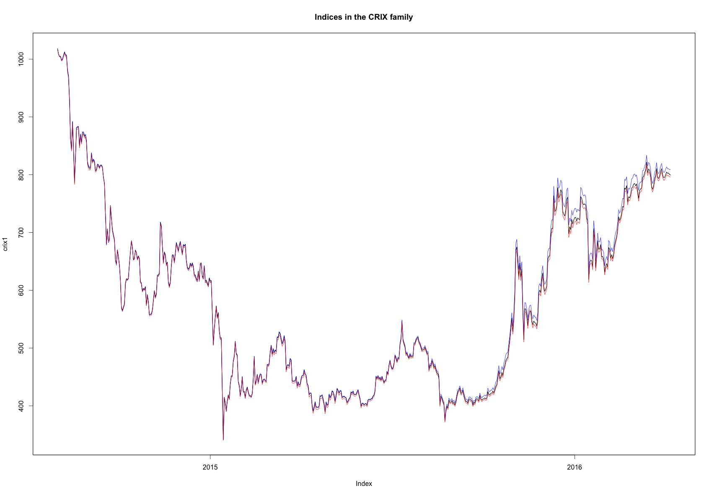
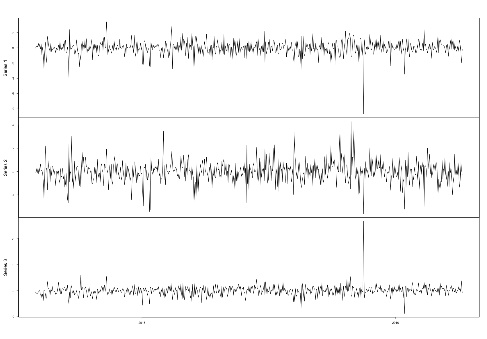
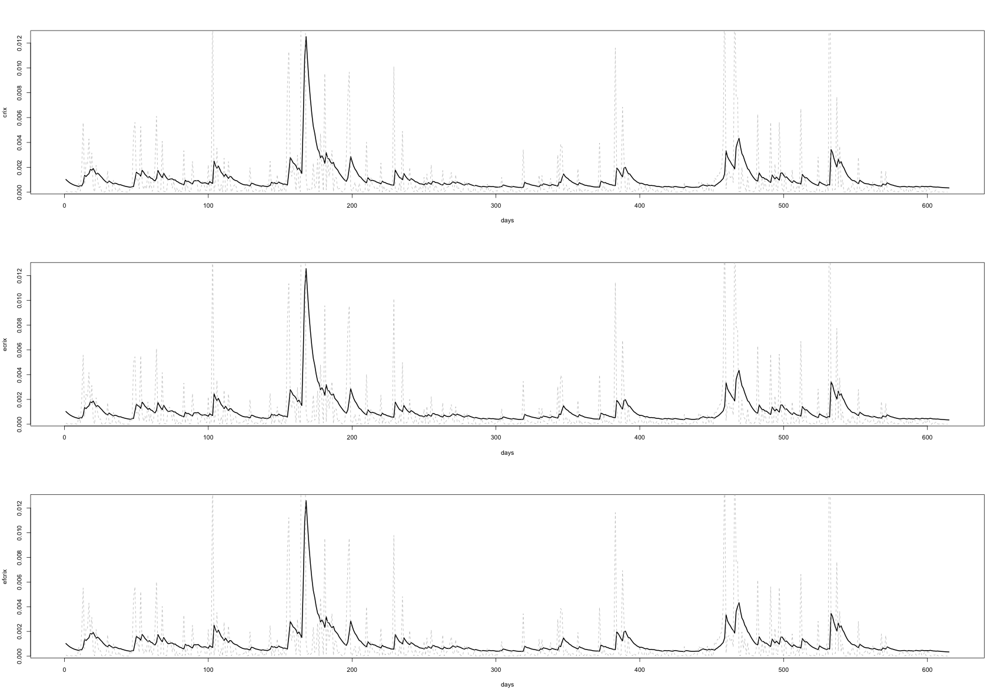
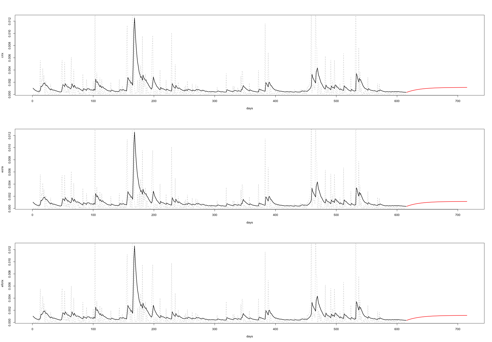
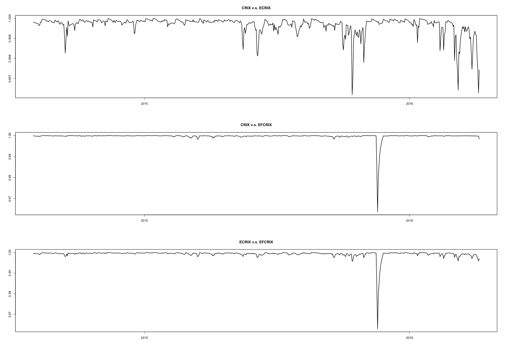
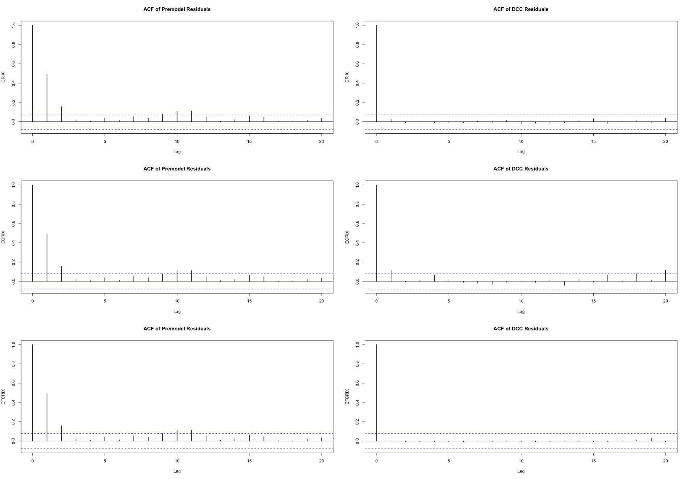
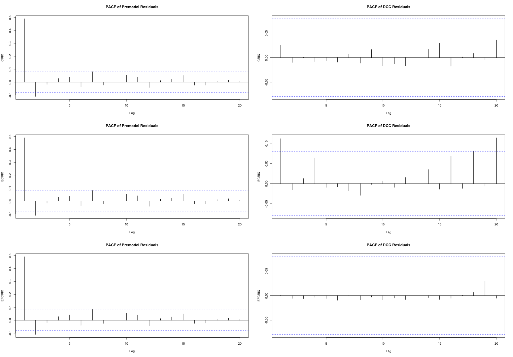

[](http://quantlet.de/index.php?p=info)

## [](http://quantlet.de/) **econ_arch** [](http://quantlet.de/d3/ia)

```yaml
Name of QuantLet : econ_arch

Published in : EconCrix

Description : 'Produces DCC-GARCH estimation results using ARIMA model residuals.'

Keywords : 
- graphical representation
- plot 
- time-series
- data visualization
- garch
- forecast
- estimation

See also : 'econ_arima, econ_crix, econ_garch, econ_vola'

Author : Shi Chen

Submitted : Thur, July 28 2016 by Shi Chen

Datafile : 'crix.RData, ecrix.RData, efcrix.RData'

Example : 
- The time path of three indices in the crix family
- The standard DCC-GARCH model residuals.
- The estimated and realised volatility using DCC-GARCH model
- The 100-ahead forecast of volatility using DCC-GARCH model
- The estimated correlation using DCC-GARCH model
- The comparison of ACF plots between premodel residual and DCC-GARCH residuals
- The comparison of PACF plots between premodel residual and DCC-GARCH residuals

```














### R Code:
```r
rm(list = ls(all = TRUE))
graphics.off()

# install and load packages
libraries = c("ccgarch", "rmgarch", "xts", "zoo")
lapply(libraries, function(x) if (!(x %in% installed.packages())) {
install.packages(x)
})
lapply(libraries, library, quietly = TRUE, character.only = TRUE)

load(file = "crix.RData")
load(file = "ecrix.RData")
load(file = "efcrix.RData")

# three indices return
ecrix1 = zoo(ecrix, order.by = index(crix1))
efcrix1 = zoo(efcrix, order.by = index(crix1))

# plot with different x-axis scales with zoo
my.panel <- function(x, ...) {
lines(x, ...)
lines(ecrix1, col = "blue")
lines(efcrix1, col = "red")
}

plot.zoo(crix1, plot.type = "multiple", type = "l", lwd = 1.5, panel = my.panel, 
main = "Indices in the CRIX family")

# crix return
cret = diff(log(crix1))
ecret = diff(log(ecrix1))
efcret = diff(log(efcrix1))
rix = zoo(cbind(cret, ecret, efcret), order.by = index(crix1))

# arima fitting for each index
cr.arfit = arima(cret, order = c(2, 0, 2))
tsdiag(cr.arfit)
cres = cr.arfit$residuals

ecr.arfit = arima(ecret, order = c(2, 0, 2))
tsdiag(ecr.arfit)
ecres = ecr.arfit$residuals

efcr.arfit = arima(efcret, order = c(2, 0, 2))
tsdiag(cr.arfit)
efcres = efcr.arfit$residuals

rixres = zoo(cbind(cres, ecres, efcres), order.by = index(crix1))

# crix, ecrix and efcrix
garch11.spec = ugarchspec(mean.model = list(armaOrder = c(0, 0)), variance.model = list(garchOrder = c(1, 
1), model = "sGARCH"))

dcc.garch11.spec = dccspec(uspec = multispec(replicate(3, garch11.spec)), 
dccOrder = c(1, 1), distribution = "mvnorm")

fitall = dccfit(dcc.garch11.spec, data = rixres)
print(fitall)

fitall@mfit$Qbar  #unconditional covariance matrix

# standard error of DCC
fitall@mfit$stdresid
par(mfrow = c(1, 1))
serr = zoo(fitall@mfit$stdresid, order.by = index(crix1))
plot.zoo(serr, plot.type = "multiple", type = "l", lwd = 1.5, main = NA, 
xlab = NA)

# new impact covariance surface
par(mfrow = c(3, 1))
nisurface(fitall, pair = c(1, 2), plot = T)
nisurface(fitall, pair = c(1, 3), plot = T)
nisurface(fitall, pair = c(2, 3), plot = T)

## DCC conditional covariance
par(mfrow = c(3, 1))
rcovr = rcov(fitall)
fitall@mfit$H  # same as rcov(fitall)
# realized vola and estimated vola
plot(rcovr[1, 1, ], type = "l", lwd = 2, xlab = "days", ylab = "crix")
lines(c(cres^2), col = "grey", lty = 2)
plot(rcovr[2, 2, ], type = "l", lwd = 2, xlab = "days", ylab = "ecrix")
lines(c(ecres^2), col = "grey", lty = 2)
plot(rcovr[3, 3, ], type = "l", lwd = 2, xlab = "days", ylab = "efcrix")
lines(c(efcres^2), col = "grey", lty = 2)

### DCC conditional correlation plot
rcorr = rcor(fitall)
rcorr1 = as.zoo(rcorr[1, , ])
par(mfrow = c(3, 1))
plot(zoo(rcorr[1, 2, ], order.by = index(crix1)), lwd = 2, ylab = NA, xlab = NA, 
main = "CRIX v.s. ECRIX")
plot(zoo(rcorr[1, 3, ], order.by = index(crix1)), lwd = 2, ylab = NA, xlab = NA, 
main = "CRIX v.s. EFCRIX")
plot(zoo(rcorr[2, 3, ], order.by = index(crix1)), lwd = 2, ylab = NA, xlab = NA, 
main = "ECRIX v.s. EFCRIX")

# acf and pacf
par(mfrow = c(3, 2))
stdres = fitall@mfit$stdresid

acf(cres^2, ylab = "CRIX", lag.max = 20, main = "ACF of Premodel Residuals", 
lwd = 2)
acf(stdres[, 1]^2, ylab = "CRIX", lag.max = 20, main = "ACF of DCC Residuals", 
lwd = 2)
acf(ecres^2, ylab = "ECRIX", lag.max = 20, main = "ACF of Premodel Residuals", 
lwd = 2)
acf(stdres[, 2]^2, ylab = "ECRIX", lag.max = 20, main = "ACF of DCC Residuals", 
lwd = 2)
acf(efcres^2, ylab = "EFCRIX", lag.max = 20, main = "ACF of Premodel Residuals", 
lwd = 2)
acf(stdres[, 3]^2, ylab = "EFCRIX", lag.max = 20, main = "ACF of DCC Residuals", 
lwd = 2)

pacf(cres^2, lag.max = 20, main = "PACF of Premodel Residuals", lwd = 2, 
ylab = "CRIX")
pacf(stdres[, 1]^2, lag.max = 20, main = "PACF of DCC Residuals", lwd = 2, 
ylab = "CRIX")
pacf(ecres^2, lag.max = 20, main = "PACF of Premodel Residuals", lwd = 2, 
ylab = "ECRIX")
pacf(stdres[, 2]^2, lag.max = 20, main = "PACF of DCC Residuals", lwd = 2, 
ylab = "ECRIX")
pacf(efcres^2, lag.max = 20, main = "PACF of Premodel Residuals", lwd = 2, 
ylab = "EFCRIX")
pacf(stdres[, 3]^2, lag.max = 20, main = "PACF of DCC Residuals", lwd = 2, 
ylab = "EFCRIX")

# 100-step ahead forecasts of estimated vola
fitallpred = dccforecast(fitall, n.ahead = 100)
plot(fitallpred, pair = c(1, 3), which = 3)

rcovrfore = fitallpred@mforecast$H[[1]]
rrr = seq(616, 715, 1)
fores1 = zoo(rcovrfore[1, 1, ], order.by = rrr)
fores2 = zoo(rcovrfore[2, 2, ], order.by = rrr)
fores3 = zoo(rcovrfore[3, 3, ], order.by = rrr)

par(mfrow = c(3, 1))
plot(rcovr[1, 1, ], type = "l", lwd = 2, xlab = "days", ylab = "crix", 
xlim = c(0, 715))
lines(c(cres^2), col = "grey", lty = 2)
lines(fores1, xlim = c(616, 715), col = "red", lwd = 2)

plot(rcovr[2, 2, ], type = "l", lwd = 2, xlab = "days", ylab = "ecrix", 
xlim = c(0, 715))
lines(c(ecres^2), col = "grey", lty = 2)
lines(fores2, xlim = c(616, 715), col = "red", lwd = 2)

plot(rcovr[3, 3, ], type = "l", lwd = 2, xlab = "days", ylab = "efcrix", 
xlim = c(0, 715))
lines(c(efcres^2), col = "grey", lty = 2)
lines(fores3, xlim = c(616, 715), col = "red", lwd = 2)

# corr forecast
forecorr = fitallpred@mforecast$Q[[1]]
fores1 = zoo(forecorr[1, 2, ], order.by = rrr)
fores2 = zoo(forecorr[1, 3, ], order.by = rrr)
fores3 = zoo(forecorr[2, 3, ], order.by = rrr)

```
